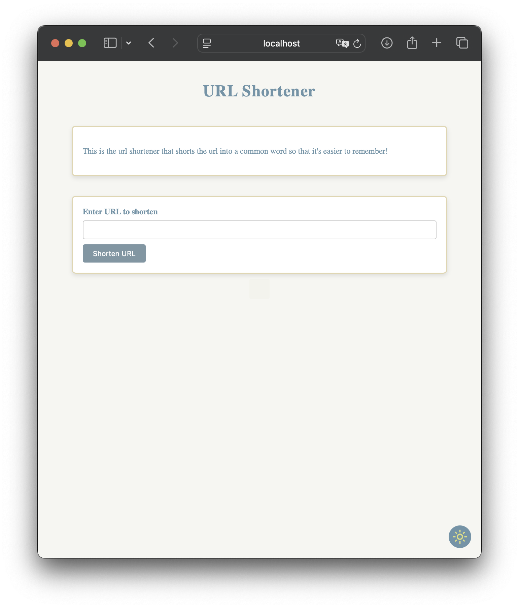
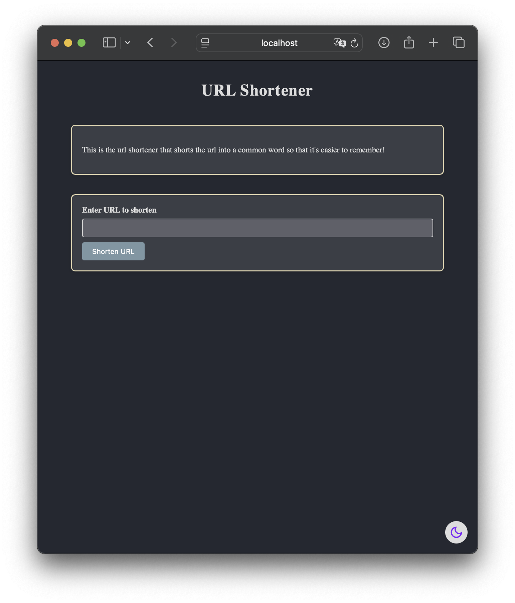
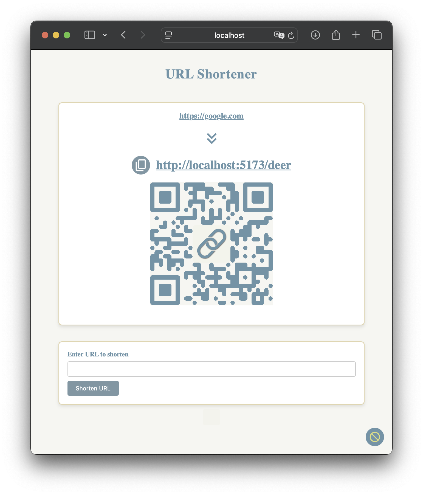
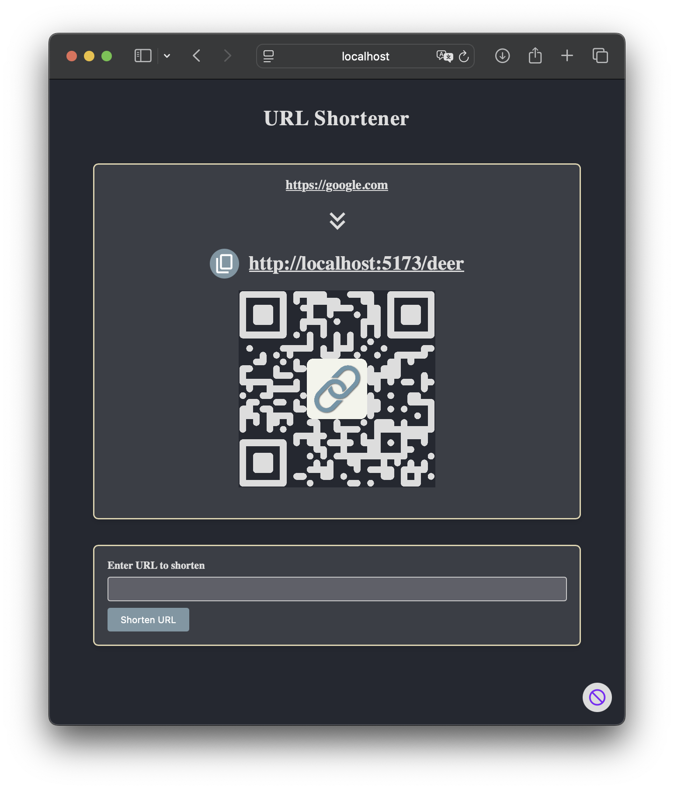
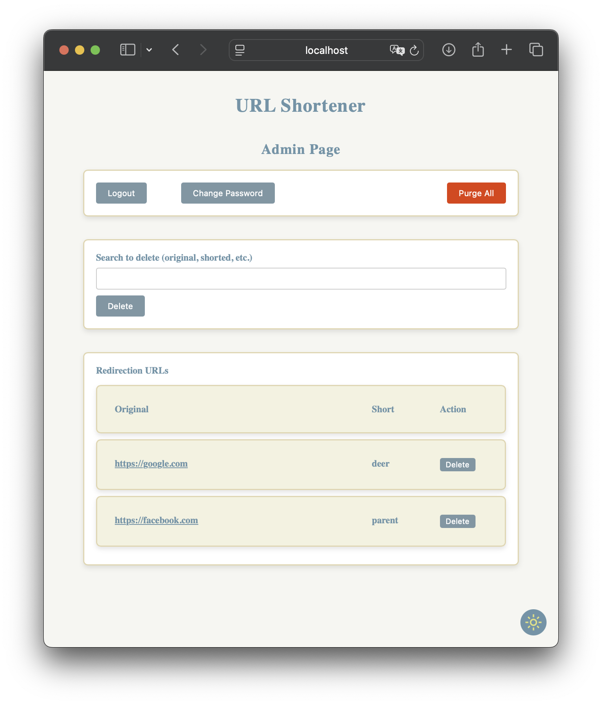

# Simple URL Shortener

A very simple URL shortener that converts URLs into easy-to-remember English words for improved usability.

[台灣繁體中文 請按這](README_zh-tw.md)

---

## Table of Contents 📖

- [Features ✨](#features-)
- [Screenshots 📸](#screenshots-)
- [Usage 🚀](#usage-)
    - [Installation ⚙️](#installation-)
    - [Admin Panel 🛡](#admin-panel-)
    - [Setting the Rate Limit 🕒](#setting-the-rate-limit-)
    - [Changing the Default Port 🔌](#changing-the-default-port-)
    - [Customizing the Dictionary 📚](#customizing-the-dictionary-)
- [Build It Yourself 🛠](#build-it-yourself-)
    - [File Structure 🗄](#file-structure-)
    - [Prerequisites ✅](#prerequisites-)
    - [Building 🚧](#building-)
- [Special Thanks 🙏](#special-thanks-)
- [Notes 📝](#notes-)
    - [External Sources Used 💿](#external-sources-used-)
    - [Known Bugs 🐛](#known-bugs-)
    - [Hidden Features 🙈](#hidden-features-)
- [Issues / Bugs? 🙋‍♀️](#issues--bugs-)

---

## Features ✨

Found randomly generated URLs too hard to remember? This project offers another solution:

- Generates user-friendly shortened URLs like [https://example.com/apple](https://google.com).
- Apple mobile web app capability—add it to your home screen for a full-screen app-like experience.
- Supports light and dark modes for a better user experience.
- Fully customizable dictionary for tailored URL shortening.

---

## Screenshots 📸

<div align="center">

<table>
    <thead>
        <tr>
            <th style="text-align: center;">Light Mode ⚪</th>
            <th style="text-align: center;">Dark Mode ⚫</th>
        </tr>
    </thead>
    <tbody>
        <tr>
            <td align="center">
                <br/>
                🏠⚪ Main page light mode
            </td>
            <td align="center">
                <br/>
                🏠⚫ Main page dark mode
            </td>
        </tr>
        <tr>
            <td align="center">
                <br/>
                🏠⚪🔗 Main page light mode with QR Code
            </td>
            <td align="center">
                <br/>
                🏠⚫🔗 Main page dark mode with QR Code
            </td>
        </tr>
        <tr>
            <td align="center">
                <br/>
                🛡⚪ Admin page light mode
            </td>
            <td align="center">
                <br/>
                🛡⚫ Admin page dark mode
            </td>
        </tr>
    </tbody>
</table>

</div>

---

## Usage 🚀

### Installation ⚙️

1. Download the release ZIP file from the release page. To build it yourself, please refer
   to [Build It Yourself](#build-it-yourself-).
2. Unzip the file.
3. Run the setup script:
   ```bash
   bash setup.sh

   # If Docker requires root permission
   sudo bash setup.sh
   ```
4. Follow the prompts to enter variables and parameters.
5. You're all set!

### Admin Panel 🛡

Access the admin panel at: `https://example.com/admin`

Default admin account:

```plaintext
username: admin
password: admin
```

Remember to change the password after the first login.

### Setting the Rate Limit 🕒

The rate limit is set in nginx.
Default setting allows 10 requests per minute.
You can modify the limit in
`docker/nginx/nginx.conf`.

### Changing the Default Port 🔌

By default, the web service runs on port 8887. To change it, edit the `docker-compose.yaml` file.

### Customizing the Dictionary 📚

Customize the dictionary by editing the `dictionary.txt` file **before** installation.

To refresh the dictionary,
run the setup script again.
Please note that by doing so, you will lose all existing data.

**Reserved Words:**
Avoid using the following reserved words:
`login`, `admin`, `logout`, `api`, `index`, `index.html`, `change_pass`. These will be removed during setup without
notice.

---

## Build It Yourself 🛠

### File Structure 🗄

#### Source Code 🧑‍💻

- **Frontend:** Built using Vite, located in the `web-frontend` folder.
- **Backend:** Built using Python FastAPI, located in the `python-backend` folder.

#### Docker 🐳

- `docker/web`: Contains built frontend files.
- `docker/backend`: Contains Python backend files.
- `docker/nginx`: Contains Nginx `default.conf`.

### Prerequisites ✅

1. Node.js >= 23.5.0
2. Python >= 3.13.1

### Building 🚧

#### Frontend 🌐

1. Navigate to the `web-frontend` folder.
2. Install dependencies:
   ```bash
   npm install
   ```
3. (Optional) Modify the code as you wish.
4. (Optional) Vite can be executed in development mode:
   ```bash
   npm run dev
   ```
5. Build the frontend:
   ```bash
   npm run build
   ```
6. Copy the `dist` folder to `docker/` and rename it to `web`.

#### Backend 👨‍🔧

The FastAPI documentation is in https://example.com/api/v1/docs.

The authentication token is there to bypass the cookie for easy developing, so you only need either cookie or
authentication token to access the locked part of API in the documentation.

The token is stored in the `docker/backend/.env` file.
If it's setup by `setup.sh`, there will also be a copy stored in
`token.txt`.

If you want to modify the backend, follow these steps. Otherwise, copy the `python-backend` folder to `docker/` and
rename it to `backend`.

1. Navigate to the `python-backend` folder.
2. (Optional, take venv for example) Create a virtual environment:
   ```bash
   python -m venv venv
   ```
3. (Skip if not using a virtual environment) Activate the virtual environment:
   ```bash
    source venv/bin/activate
    ```
4. Install dependencies:
   ```bash
   pip install -r requirements.txt
   ```
5. Modify the code as you wish.
6. Run the backend in development mode:
   ```bash
   python app.py
   ```
7. After modifying the backend, copy the `python-backend` folder to `docker/` and rename it to `backend`.

---

## Special Thanks 🙏

Thanks to [@xinshoutw](https://github.com/xinshoutw) for helping me out on this project 😄.

Thanks to Liang Ye for helping me to design the UI 🎨.

---

## Notes 📝

### External Sources Used 💿

- SVG file from [Google Fonts](https://fonts.google.com/icons)

### Known Bugs 🐛

- QR Code Styling: The QR Code generated by QR code styling may not be able to display correctly across different
  devices, especially on Safari of all platforms.

### Hidden Features 🙈

- A hidden invisible admin button is placed in the center under the Shorten URL form in the home page.

---

## Issues / Bugs? 🙋‍♀️

Encounter issues or bugs? Feel free to report them in Issues and submit Pull Requests. For pull requests, target the
`modding`
branch.