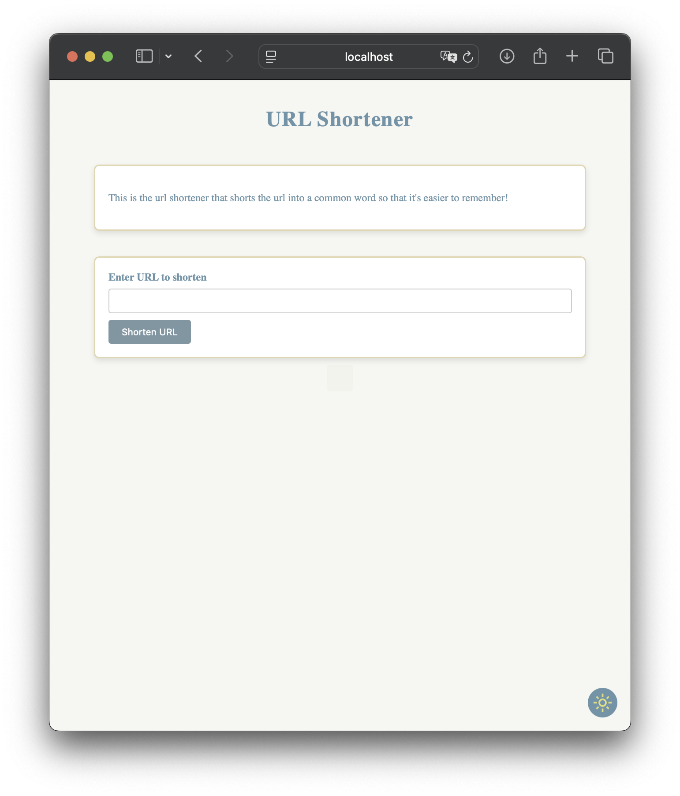
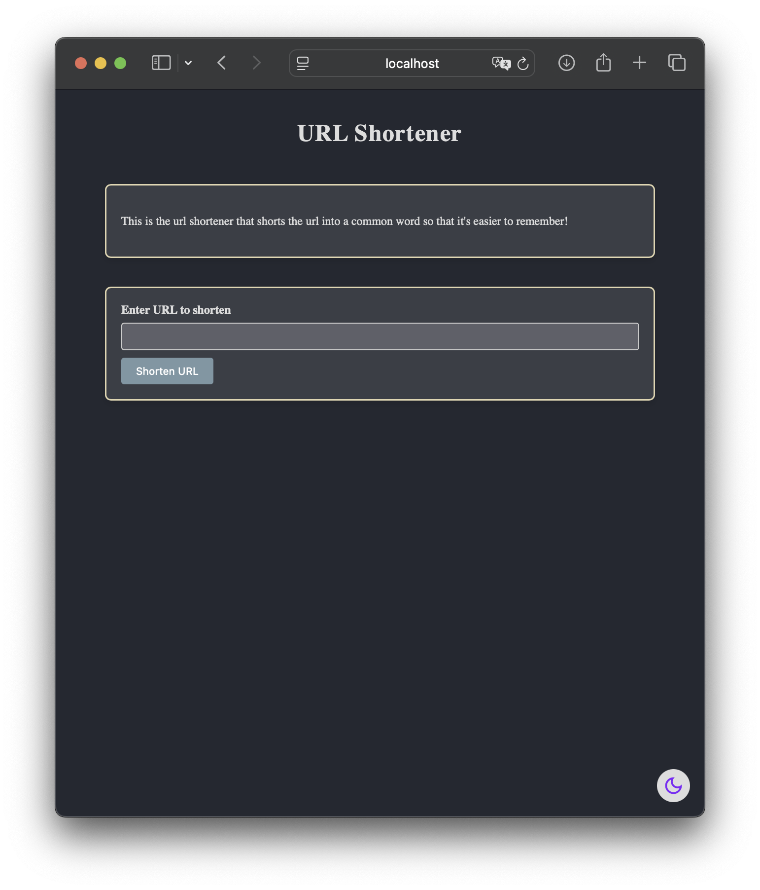
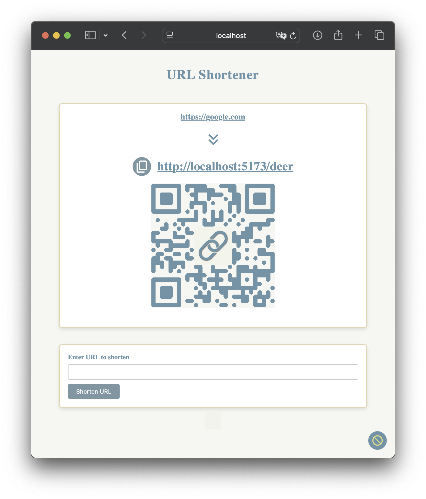
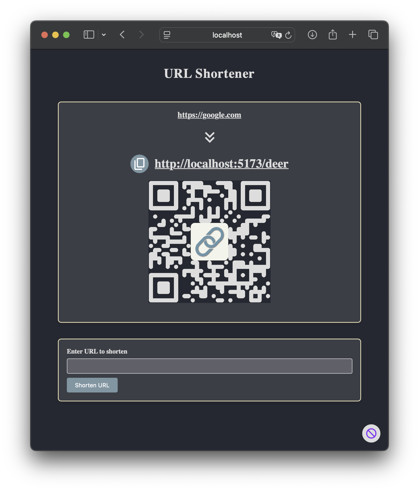
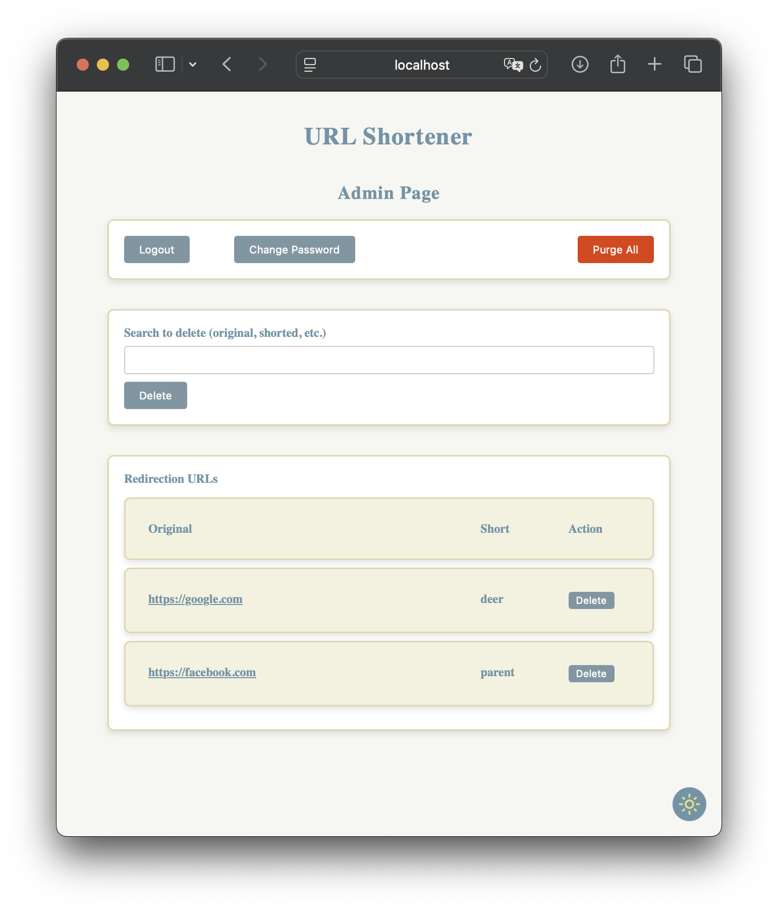
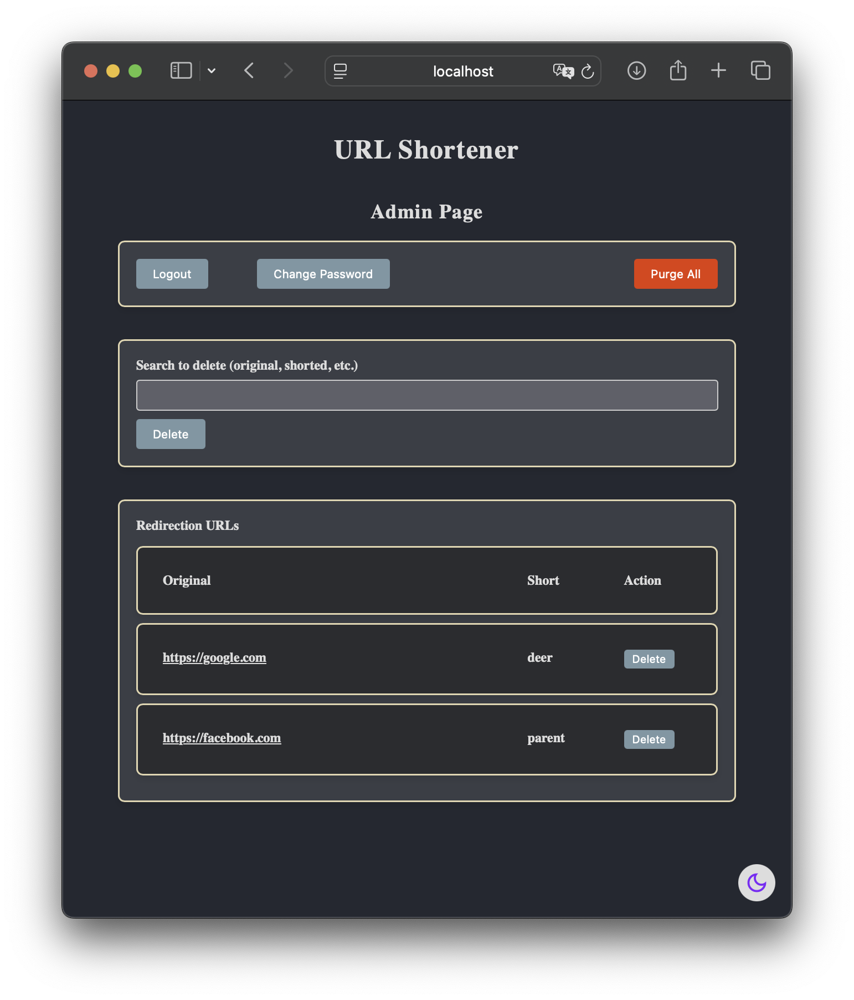

# Simple URL Shortener

一個簡單的短網址器，將網址轉換為易於記憶的英文單字，使其容易記憶。

[Link for English version](README.md)

---

## 目錄 📖

- [特點 ✨](#特點-)
- [截圖 📸](#截圖-)
- [用法 🚀](#用法-)
    - [安裝 ⚙️](#安裝-)
    - [管理員頁面 🛡](#管理員頁面-)
    - [設定速率限制 🕒](#設定速率限制-)
    - [修改預設連接埠 🔌](#修改預設連接埠-)
    - [客製化字典 📚](#客製化字典-)
- [自己建構 🛠](#自己建構-)
    - [檔案結構 🗄](#檔案結構-)
    - [原始碼 ✅](#原始碼-)
    - [建構 🚧](#建構-)
- [鳴謝 🙏](#鳴謝-)
- [備註 📝](#備註-)
    - [使用的外部資源 💿](#使用的外部資源-)
    - [已知的bug 🐛](#已知的bug-)
    - [隱藏的功能 🙈](#隱藏的功能-)
- [問題 / Bugs? 🙋‍♀️](#問題--bugs-)

---

## 特點 ✨

覺得隨機產生的網址太難記住了嗎？這個專案提供了另一個解決辦法：

- 生成易於記憶的縮短網址，例如 [https://example.com/apple](https://google.com)。
- Apple 手機網頁應用程式功能——將其添加到主螢幕，以獲得全螢幕應用程式般的體驗。
- 支援淺色和深色模式。
- 自定義字典，客製化生成的短網址。

---

## 截圖 📸

<div align="center">

<table>
    <thead>
        <tr>
            <th style="text-align: center;">淺色模式 ⚪</th>
            <th style="text-align: center;">深色模式 ⚫</th>
        </tr>
    </thead>
    <tbody>
        <tr>
            <td align="center">
                <br/>
                🏠⚪ 主頁面淺色模式
            </td>
            <td align="center">
                <br/>
                🏠⚫ 主頁面深色模式
            </td>
        </tr>
        <tr>
            <td align="center">
                <br/>
                🏠⚪🔗 主頁面 QR Code 淺色模式
            </td>
            <td align="center">
                <br/>
                🏠⚫🔗 主頁面 QR Code 深色模式
            </td>
        </tr>
        <tr>
            <td align="center">
                <br/>
                🛡⚪ 管理員頁面淺色模式
            </td>
            <td align="center">
                <br/>
                🛡⚫ 管理員頁面深色模式
            </td>
        </tr>
    </tbody>
</table>

</div>

---

## 用法 🚀

### 安裝 ⚙️

1. 從發行（release）下載 ZIP 檔。如果想要自己 build，請至[自己建構](#自己建構-)。
2. 解壓縮檔案。
3. 執行安裝腳本：
   ```bash
   bash setup.sh

   # 如果 Docker 需要 root 權限
   sudo bash setup.sh
   ```
4. 跟隨提示輸入變數和參數。
5. 大功告成！

### 管理員頁面 🛡

在 `https://example.com/admin` 訪問管理員面板。

預設管理員帳號：

```plaintext
使用者: admin
密碼: admin
```

請在第一次登錄後更改密碼。

### 設定速率限制 🕒

速率限制設定在 nginx。預設允許每分鐘 10 次請求。可以在 `docker/nginx/nginx.conf` 中修改限制。

### 修改預設連接埠 🔌

網頁預設執行在連結埠 8887。如要更改，請編輯 `docker-compose.yaml` 檔案。

### 客製化字典 📚

在安裝之前，可通過編輯 `dictionary.txt` 檔案來客製化字典。

如要更新所使用的字典，請再次執行安裝腳本。請注意，這樣做將會丟失所有現有的資料。

**保留字：**
請避免使用以下單字：
`login`、`admin`、`logout`、`api`、`index`、`index.html`、`change_pass`。 這些單字會在執行 `setup.sh` 初始化時被刪掉。

---

## 自己建構 🛠

### 檔案結構 🗄

#### 原始碼 🧑‍💻

- **前端:** 使用Vite，在 `web-frontend` 資料夾中。
- **後端:** 使用Python的FastAPI，在 `python-backend` 資料夾中。

#### Docker 🐳

- `docker/web`：包含建構完的前端檔案。
- `docker/backend`：包含Python所寫的後端檔案。
- `docker/nginx`：包含 Nginx `default.conf` 檔案。

### 事前準備 ✅

1. Node.js >= 23.5.0
2. Python >= 3.13.1

### 建構 🚧

#### 前端 🌐

1. 移至 `web-frontend` 資料夾。
2. 安裝依賴：
   ```bash
   npm install
   ```
3. (可選) 更動程式碼。
4. (可選) Vite 開發時可使用以下指令執行：
   ```bash
   npm run dev
   ```
5. 建構前端：
   ```bash
   npm run build
   ```
6. 將 `dist` 資料夾複製到 `docker/` 並將其命名為 `web`。

#### 後端 👨‍🔧

FastAPI 說明文件在 https://example.com/api/docs。

Authentication token 是為了開發方便繞過 cookie 驗證所使用，你可以選擇使用 cookie 或是 token 使用在說明文件中有鎖頭的 API 資源。

Authentication token 存在於 `docker/backend/.env` 檔案中。如果是透過 `setup.sh` 設定，則會有另一份存放在 `token.txt` 中。

如果要修改後端，請按照以下步驟。否則，將 `python-backend` 資料夾複製到 `docker/` 並將其命名為 `backend`。

1. 移至 `python-backend` 資料夾。
2. (可選，使用venv作為範例) 建立虛擬環境：
   ```bash
   python -m venv venv
   ```
3. (如果沒有使用虛擬環境請跳過) 啟用虛擬環境：
   ```bash
    source venv/bin/activate
    ```
4. 安裝依賴：
   ```bash
   pip install -r requirements.txt
   ```
5. 更改程式碼。
6. 在開發模式執行：
   ```bash
   python app.py
   ```
7. 在更改後端後，將 `python-backend` 資料夾複製到 `docker/` 並將其命名為 `backend`。

---

## 鳴謝 🙏

感謝 [@xinshoutw](https://github.com/xinshoutw) 在此專案提供幫助 😄。

感謝俍曄提供UI設計的協助 🎨。

---

## 備註 📝

### 使用的外部資源 💿

- [Google Fonts](https://fonts.google.com/icons) 的 SVG 檔案

### 已知的bug 🐛

- QR Code Styling: QR code styling 所產生的 QR Code 可能無法在所有裝置上顯示，尤其是全平台的Safari。

### 隱藏的功能 🙈

- 在首頁縮短網址的表單框框的下面中間有一個隱藏且隱形的按鈕，按下可直接重新導向到管理員頁面。

---

## 問題 / Bugs? 🙋‍♀️

歡迎於 Issues 提出任何問題與 Pull Request。請注意 Pull Request 只接受對於 `modding` 分支的請求。

